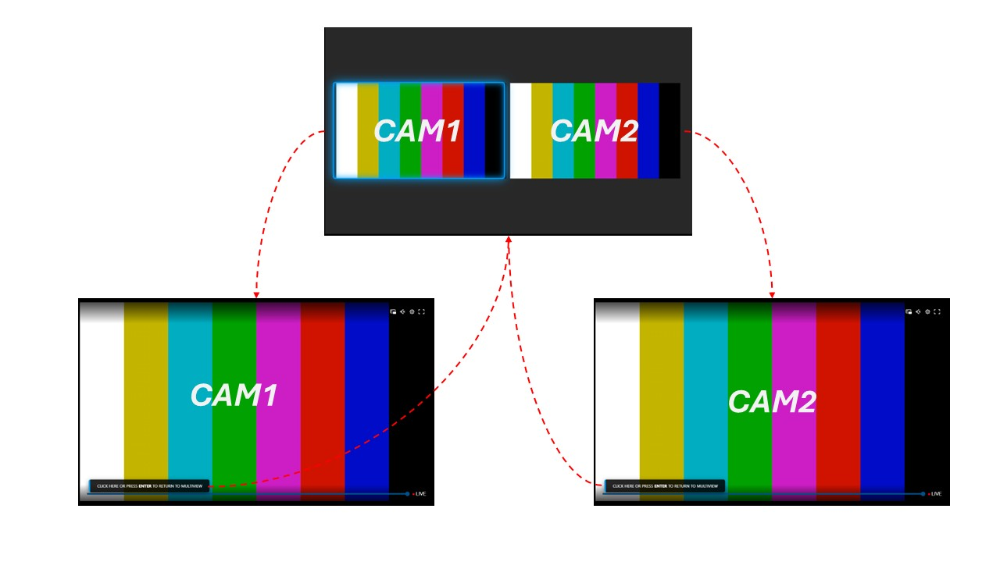

# MKPlayer Interactive Multiview

This template provides an interactive multi-camera viewing experience using the **MediaKind Player (MKPlayer) SDK** and the power of the **MK.IO** video cloud platform.

## Overview

The experience begins by loading a single composited 2-up mosaic rendered in MK.IO Multiview. Users can interact with the video to "expand" a specific camera to full screen. 

## Key Features

1.  **Low Bandwidth Footprint:** Optimizes network traffic by requesting only the manifest for the active view (either the mosaic or the individual camera)
2.  **Fluid Source Switching:** Leverages the `player.load()` method to switch between synchronized DASH/CMAF manifests seamlessly
3.  **Visual Feedback (Blue Glow):** Features a neon "Blue Glow" frame that highlights the selected camera window within the mosaic for clear user navigation
4.  **Dual Interaction Support:**
    *   **Mouse:** Hover over a camera to see the glow effect and click to expand it.
    *   **Keyboard:** Navigate between cameras using **Left/Right arrow keys** and select or return using the **ENTER** key
5.  **Activity Management:** Includes an auto-hide timer that fades out UI overlays after 3 seconds of inactivity to provide an unobstructed viewing experience

## Setup and Configuration

Open `multiview.html` and update the following variables in the `<script>` section:

### 1. License Key
Insert your MKPlayer license key:
```javascript
const playerConfig = {
    key: "YOUR_LICENSE_KEY_HERE",
    ui: true,
    playback: { autoplay: true, muted: true }
};
```

### 2. Manifest URLs

Update the sources object with your specific MK.IO Streaming Endpoint paths:
```javascript
const sources = {
    multiview: { dash: " HERE_YOUR_MULTIVIEW_MANIFEST_URL " },
    cam1: { dash: "HERE_YOUR_CAM1_MANIFEST_URL " },
    cam2: { dash: "HERE_YOUR_CAM2_MANIFEST_URL" }
};
```

## How to Use

1. **Navigation**: In Multiview mode, move your mouse or use the Left/Right arrow keys. A blue glow will appear around the focused camera window based on the layout coordinates.
2. **Selection**: Click on a camera or press ENTER to switch to that specific camera in full screen.
3. **Return to Mosaic**: While viewing a single camera, click the return hint or press ENTER to return to the Multiview mosaic.
4. **UI Visibility**: Stop all interactions for 3 seconds to hide the interaction overlays automatically.


